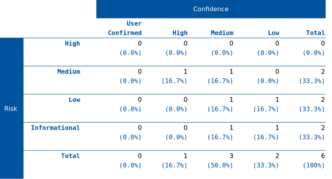

# Dynamic code analysis OWASP-ZAP

- [Installation](#installation)
- [Scan](#scan)
- [Results](#results)


## Installation

OWASP ZAP (Zed Attack Proxy) is an open-source web application security testing tool. It is developed by the OWASP (Open Web Application Security Project), a global community dedicated to improving software security.

In order to get the OWASP-ZAP software you can either download it from their website or get their package with :

```bash
sudo apt-get install zaproxy
```

Once the installation is completed (may take several minutes) you can proceed to the application by inputing :

```bash
zaproxy
```

## Scan

Upon entering the application, you'll encounter various add-on options. If you wish to install additional scans or add-ons, there's a marketplace available.

After closing the add-ons pop-up, you'll be asked to choose a port for ZAP. We typically recommend selecting port 8081, as 8080 is usually reserved for Thingsboard (unless altered).

For the scanning process, on the app's front page, you'll select from three options; we'll choose the "Automated Scan." Then, specify the URL to scan; in our case, it's localhost:8080 (the Thingsboard web app).

Once you click "Start the Scan," your computer might slow down briefly.

After a few minutes, you'll find various alerts at the bottom left of ZAP. Here, you can review detected issues, including their severity and scan confidence.

After completion, you can export the data through the navigator, resulting in an HTML report accessible via a web browser. This report summarizes the findings from the scan.

## Results



Here's the list of the main issues that were spotted by ZAP

>Missing Anti-clickjacking Header

>Content Security Policy (CSP) Header Not Set

>X-Content-Type-Options Header Missing

>Timestamp Disclosure - Unix

